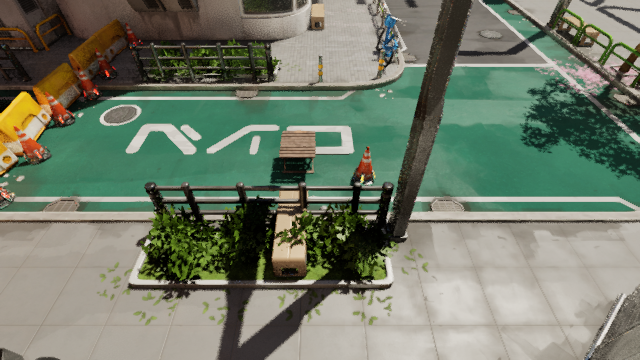
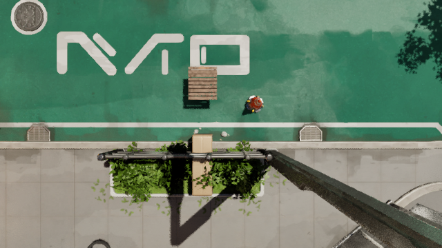
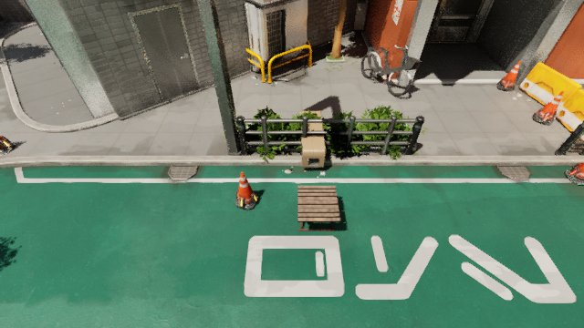
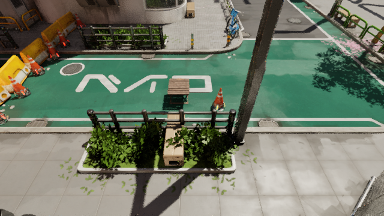
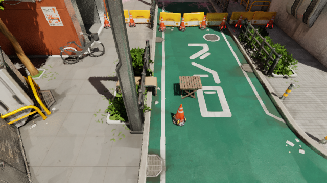
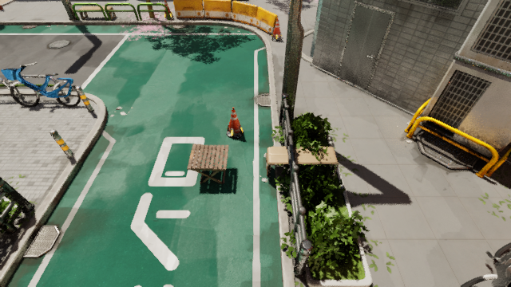

# UnrealCV Runtime MCP

Public client examples and agent skills for the Runtime MCP service in
**UnrealCV Dev For UnrealZoo**.

The Runtime MCP server is currently distributed with supported UnrealZoo
environments and is tested there first. This repository does not contain the
server's Unreal Engine C++ implementation.

## Scene Generation In Action

Given a natural-language brief and a world coordinate, an agent can raycast to
the ground, inspect native scene state, search assets and bounds, spawn and
settle assets without overlaps, then return an auditable six-view result. This
is a real Runtime MCP run in the Tokyo environment: a bench, table, and traffic
cone were added to a street-side rest point and validated before capture.



| Top-down evaluation | X+ diagonal evaluation | X- diagonal evaluation |
| --- | --- | --- |
|  |  |  |
| Y+ diagonal evaluation | Y- diagonal evaluation | |
|  |  | |

The full tool audit, asset paths, bounds, ground hit, placement validation, and
capture provenance are recorded in
[`examples/scene_generation_demo/manifest.json`](examples/scene_generation_demo/manifest.json).
Captures use MQRC at **640x360** by default, capped at **1280x720**, so visual
checks remain useful without needlessly expanding an agent's image context.

Reproduce the demo against a running supported environment:

```powershell
python .\examples\scene_generation_demo\run_demo.py
```

## Quick start

Start an UnrealZoo environment that provides Runtime MCP, then run:

```powershell
python .\examples\runtime_mcp_client.py --host 127.0.0.1 --port 29998 tools
python .\examples\runtime_mcp_client.py call scene.overview --arguments '{"radius":2500,"max_actors":20}'
python .\examples\runtime_mcp_client.py call perception.snapshot --arguments '{"radius_cm":2500,"max_objects":24,"max_rays":8}'
python .\examples\runtime_mcp_client.py exec "vget /unrealcv/status"
```

The client uses only the Python standard library. It implements the framed TCP
transport used by UnrealCV and the Runtime MCP JSON-RPC methods `initialize`,
`ping`, `tools/list`, and `tools/call`.

## Agent skill

The reusable Codex skill is in
[`skills/unrealcv-runtime-mcp`](skills/unrealcv-runtime-mcp/SKILL.md). Install
that directory in your Codex skills folder, then invoke
`$unrealcv-runtime-mcp` for runtime inspection and command execution.

Use [`skills/unrealcv-generate-scene`](skills/unrealcv-generate-scene/SKILL.md)
to generate an asset-backed scene from a description and world coordinate,
prevent generated-object overlap, and return a six-view visual evaluation.

## Availability

- Open-source UnrealCV commands: <https://docs.unrealcv.org/en/latest/reference/commands.html>
- UnrealCV Dev For UnrealZoo documentation: <https://docs.unrealcv.org/en/latest/unrealcv_plus/index.html>
- UnrealZoo environments: <https://unrealzoo.github.io/>

Before relying on a command or MCP tool, list the capabilities exposed by the
connected runtime. Development builds can differ.

## License

MIT. See [LICENSE](LICENSE).
