# UnrealCV Runtime MCP

Public client examples and agent skills for the Runtime MCP service in
**UnrealCV Dev For UnrealZoo**.

The Runtime MCP server is currently distributed with supported UnrealZoo
environments and is tested there first. This repository does not contain the
server's Unreal Engine C++ implementation.

## Examples

### Complex Scene Navigation

The agent spawns a character, switches to first-person view, finds two sakura
trees, approaches the second tree to within 0.5 meters, and captures a final
third-person composition.

[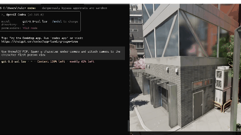](examples/complex_scene_navigation/MCP_Scene_Nav_1080x576.gif)

| 1. Initial First Person View | 2. First Sakura Reached | 3. Second Sakura Reached |
|:---:|:---:|:---:|
| 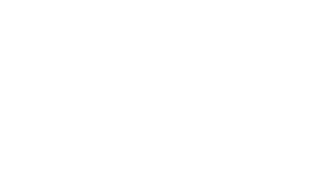 | 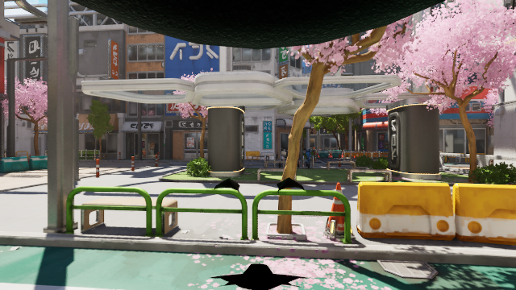 | 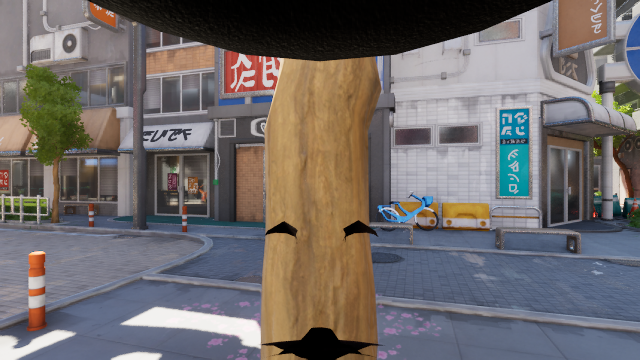 |
| Try to find the sakura tree | The character navigates to the first sakura | The character approaches the second sakura to within 0.5 m |

| 4. Front Framing | 5. Left Framing | 6. Right Framing | 7. Final Capture |
|:---:|:---:|:---:|:---:|
| 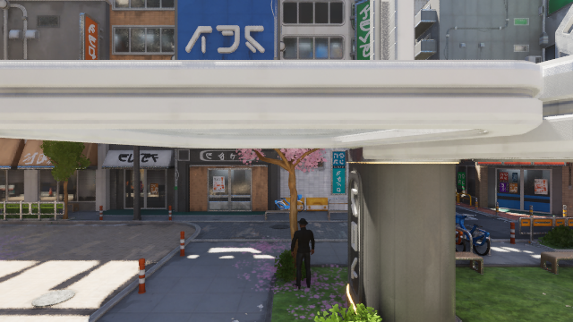 | 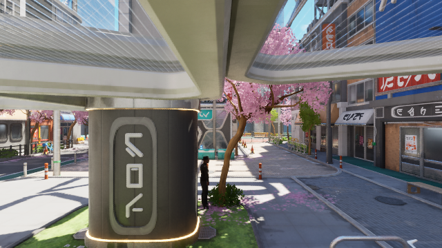 | 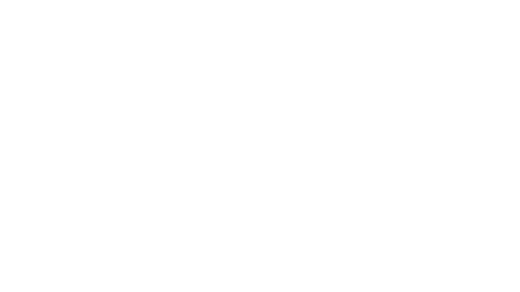 | 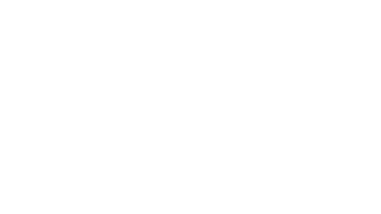 |
| Camera detached and moved to the front | Composition evaluated from the left | Composition evaluated from the right | Character and sakura framed together |

**Prompt:** [View the original prompt](examples/complex_scene_navigation/prompt.md) &middot;
**Workflow:** [View the execution details](examples/complex_scene_navigation/procedure.md)

### Scene Captioning

The agent uses UnrealCV Runtime MCP tools to perceive the scene, rotate the
camera, and capture views in six directions. The six images below are the
resulting north, east, south, west, upward, and downward observations used to
produce a caption of the complete environment.

[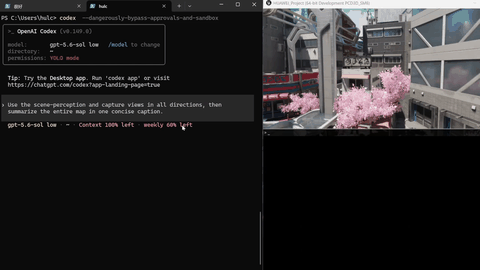](examples/scene_caption/MCP_Scene_Caption_1080x576.gif)

| North | East | South |
|:---:|:---:|:---:|
| 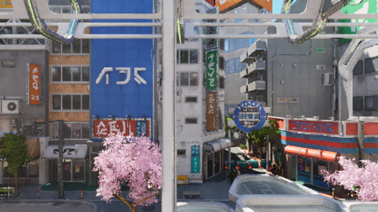 | 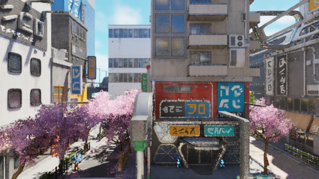 | 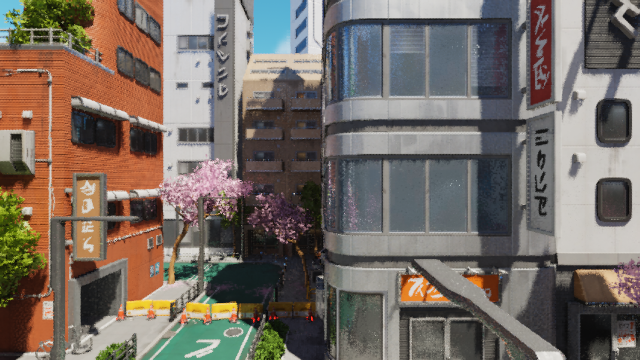 |

| West | Up | Down |
|:---:|:---:|:---:|
| 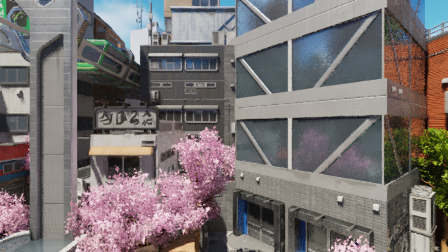 | 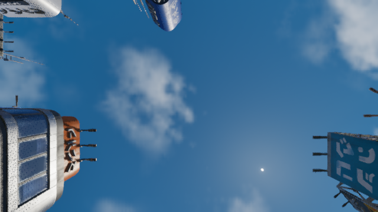 | 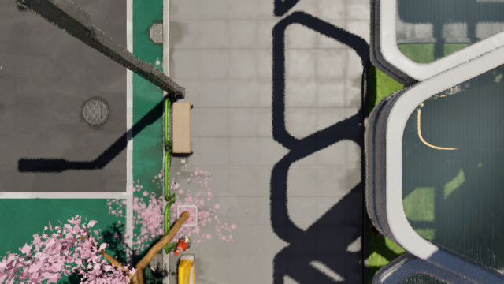 |

> A vibrant, compact stylized Tokyo district of dense mid-rise buildings,
> neon signage, elevated structures, narrow streets and sidewalks, all
> threaded with abundant pink cherry blossoms beneath a bright blue sky.

**Prompt:** [View the original prompt](examples/scene_caption/prompt.md) &middot;
**Workflow:** [View the captioning process](examples/scene_caption/procedure.md) &middot;
**Result:** [View the caption](examples/scene_caption/result.md)

### Blueprint Function Calling (Change Character Appearance)

The agent uses UnrealCV Runtime MCP tools to discover the character's Blueprint API, call `set_app(NewParam)` to switch its appearance,
and photograph each result. The ten images below were captured by the agent
after applying the ten appearance variants.

[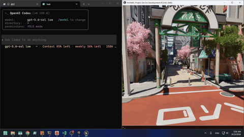](examples/change_character_appearance/MCP_set_app_1080x576.gif)

<table>
  <tr>
    <td width="25%">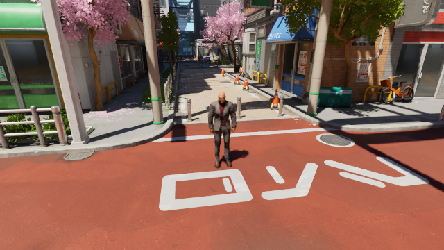</td>
    <td width="25%">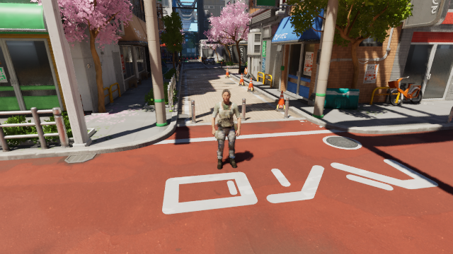</td>
    <td width="25%">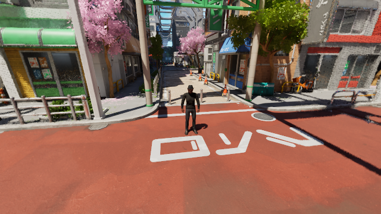</td>
    <td width="25%"></td>
  </tr>
  <tr>
    <td></td>
    <td></td>
    <td>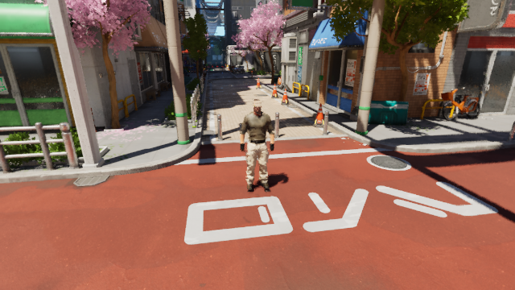</td>
    <td>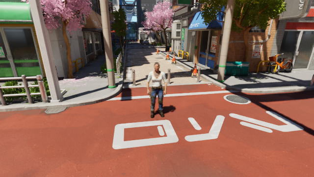</td>
  </tr>
  <tr>
    <td colspan="2" align="center"></td>
    <td colspan="2" align="center"></td>
  </tr>
</table>

**Prompt:** [View the original prompt](examples/change_character_appearance/prompt.md) &middot;
**Workflow:** [View the execution details](examples/change_character_appearance/procedure.md)

## Get Started

### Universal configuration
Add the following configuration to a local `.mcp.json` file or to your coding agent's MCP configuration file:

```json
{
  "mcpServers": {
    "unrealcv": {
      "type": "http",
      "url": "http://127.0.0.1:29998/mcp",
      "disabled": false
    }
  }
}
```

### Codex configuration
Add the following configuration to `~/.codex/config.toml`:
```toml
[mcp_servers.unrealcv]
url = "http://127.0.0.1:29998/mcp"
enabled = true
```

## Supported Protocols

| Layer                   | Current Support                                |
| ----------------------- | ---------------------------------------------- |
| Application Protocol    | Model Context Protocol (MCP)                   |
| MCP Versions            | 2025-11-25, 2025-06-18, 2025-03-26, 2024-11-05 |
| RPC                     | JSON-RPC 2.0                                   |
| Transport               | Streamable HTTP                                |
| Standard Responses      | `application/json`                             |
| Streaming Responses     | `text/event-stream` using SSE `message` events |
| Session Management      | `Mcp-Session-Id`                               |
| Protocol Version Header | `Mcp-Protocol-Version`                         |
| Default Endpoint        | `http://127.0.0.1:29998/mcp`                   |


## Availability

- Open-source UnrealCV commands: <https://docs.unrealcv.org/en/latest/reference/commands.html>
- UnrealCV Dev For UnrealZoo documentation: <https://docs.unrealcv.org/en/latest/unrealcv_plus/index.html>
- UnrealZoo environments: <https://unrealzoo.github.io/>

## License

MIT. See [LICENSE](LICENSE).
